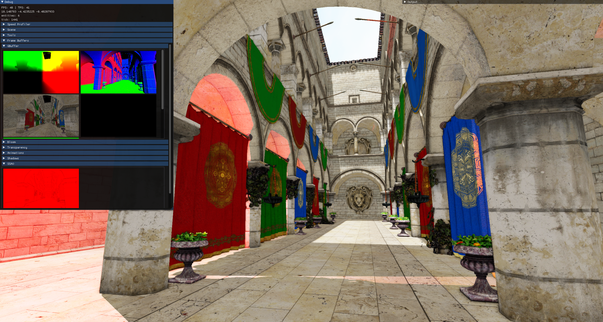
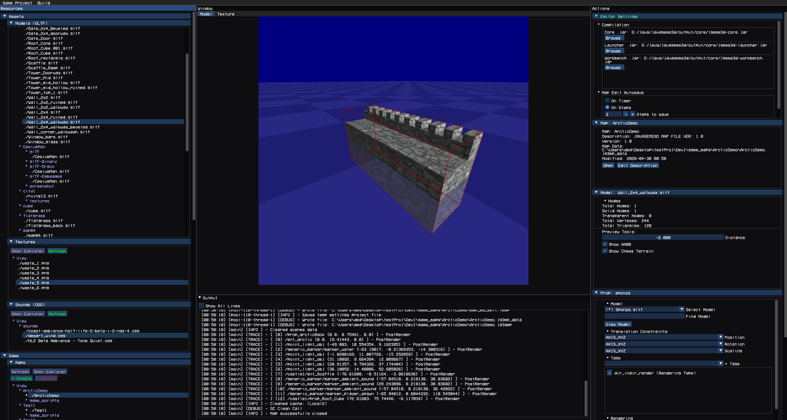
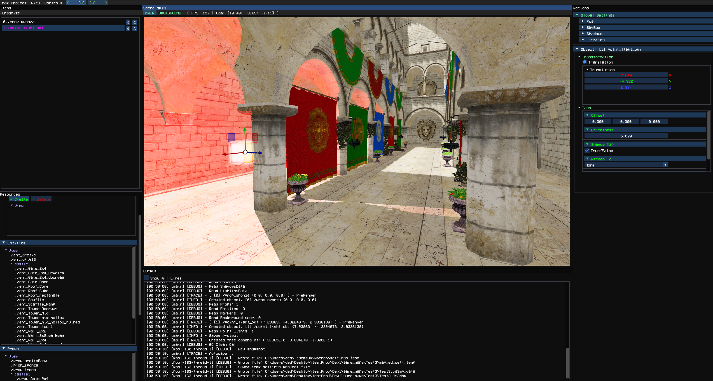

# JavaGems3D


> Lightweight Java 3D game engine designed for small-scale, experimental, and standalone game development.

---

## Overview

**JavaGems3D** is a three-dimensional game engine written in Java.

The engine uses:

* **OpenGL 4.3** for rendering
* **Bullet Physics** via  for physics simulation
* **OpenAL** for sound
* **Dear ImGui** for debug/editor UI
* Integrated **WorkBench** map editor for world building

JavaGems3D is still actively developed, but it is already stable enough for real projects and internal production workflows.

Current release status: **Beta 1.0**

The goal of the project is to provide a practical and lightweight Java 3D engine for small-scale, experimental, and standalone projects without unnecessary framework overhead.

JavaGems3D is also largely a personal learning project where I continuously improve my engine architecture, rendering systems, tooling, and overall engine design. Because of that, some systems may still contain rough edges, unfinished parts, or design decisions that are being actively reworked and improved over time.

---



---

## Project Status

JavaGems3D is under active development.

Some systems are already production-usable, while others are still being redesigned or expanded.

Main development priorities:

* rendering pipeline improvements
* documentation expansion
* API stabilization
* WBench editor improvements
* gameplay workflow simplification
* better resource management
* stronger editor → runtime integration

This is not a tech demo anymore — the engine is intended for actual game development.

---

## Documentation

> Full documentation is being expanded.

### Links

* Start Guide → `TOOLBOX_DOCS_LINK_PLACEHOLDER`
* Full Documentation → `EXAMPLES_LINK_PLACEHOLDER`

---

## Showcase

### Engine Screenshots






---

## Engine Features

| Feature                 | Status                                |
| ----------------------- | ------------------------------------- |
| 3D Rendering            | ✅ OpenGL 4.3                          |
| Physics Support         | ✅ Bullet Physics                      |
| Deferred Rendering      | ✅ Implemented                         |
| Indirect Rendering      | ✅ Implemented                         |
| GPU-driven Rendering    | ✅ Implemented                         |
| Shadows                 | ✅ Cascaded EVSM + Point Light Shadows VSM |
| Lighting                | ✅ Point Lights + Directional Light    |
| Post-Processing         | ✅ HDR, Bloom, FXAA, SSAO              |
| OIT                     | ✅ Weighted OIT + 'Discard' Blending     |
| PBR Workflow            | ❌ Planned                               |
| Material System         | ✅ Metallic / Roughness / Emission simple simulation |
| Bindless Textures       | ✅ Implemented                         |
| Sound System            | ✅ OpenAL                              |
| UI System               | ✅ Dear ImGui + Custom Runtime UI      |
| Engine API              | ✅ Implemented                         |
| Map System              | ✅ Implemented                         |
| Map Editor              | ✅ WBench Map Editor                  |
| Game Editor             | ✅ WBench Game Editor                  |
| Particle System         | ⚠️ Partial Implementation             |
| Skeletal Animation      | ✅ Implemented                         |
| Liquids / Triggers      | ⚠️ Partial Implementation                         |
| Localization System     | ✅ Implemented                         |
| Controller/Input System | ✅ Implemented                         |
| Camera System           | ✅ Implemented                             |
| Multi-threading         | ⚠️ Render + Physics Parallel          |
| AI for Entities         | ⚠️ Requires Rework                    |
| NavMesh System          | ⚠️ Requires Rework                    |
| OS Support              | ⚠️ Windows (Primary)                  |
| Linux Support           | ⚠️ Experimental                       |
| Documentation           | ⚠️ ~0.1% (actively expanding)         |
| Global Illumination     | ❌ Planned                             |
| Ray Tracing             | ❌ Planned                             |
| Network Multiplayer     | ❌ Planned                             |
| LOD System              | ❌ Planned                             |

### Status Legend

* ✅ Stable and usable
* ⚠️ Implemented but still requires rework/improvement
* ❌ Planned for future development

---

# JavaGems3D — Quick Start Guide

## Requirements

Before starting:

* Java 21 or higher
* Apache Maven (for source build)

---

## Option 1 — Build from Source

### Steps

1. Download archive from GitHub
2. Extract locally
3. Open root directory
4. Build project:

```bash
mvn package
```

---

## Option 2 — Maven Dependency (GitHub Packages)

Add dependencies:

```xml
<dependencies>
    <dependency>
        <groupId>io.github.gltexture</groupId>
        <artifactId>syslogger</artifactId>
        <version>beta0.1.X</version> // CHOOSE THE LATEST VERSION!
    </dependency>

    <dependency>
        <groupId>io.github.gltexture</groupId>
        <artifactId>launcher</artifactId>
        <version>beta0.1.X</version> // CHOOSE THE LATEST VERSION!
    </dependency>

    <dependency>
        <groupId>io.github.gltexture</groupId>
        <artifactId>engine</artifactId>
        <version>beta0.1.X</version> // CHOOSE THE LATEST VERSION!
    </dependency>

    <dependency>
        <groupId>io.github.gltexture</groupId>
        <artifactId>workbench</artifactId>
        <version>beta0.1.X</version> // CHOOSE THE LATEST VERSION!
    </dependency>
</dependencies>
```

Repository:

```xml
<repositories>
    <repository>
        <id>github</id>
        <name>GitHub Maven Packages</name>
        <url>https://maven.pkg.github.com/gltexture/javagems3d</url>
    </repository>
</repositories>
```
---

## Minimal Launch

```java
public static void main(String[] args) {
    JavaGemsLauncher.launch(args, null);
}
```

---

## Launch with API App

```java
public static void main(String[] args) {
    JavaGemsLauncher.launch(args, ApiClass.class);
}
```

---

## Option 3 — Prebuilt Release

Download from releases:

[Releases](https://github.com/gltexture/javagems3d/releases)

Includes:

* compiled engine
* launcher scripts
* ready-to-run structure

---

## WorkBench Editor

Enable editor via runtime argument:

```text
workbench=true
```

---

## Runtime Arguments

```text
win_size=1920;1080
workbench=true
debug=true
map_test=true
map_path=...
no_sound=true
no_full_screen=true
api_app_classpath="classpath"
toolbox=true
```

---

## Example API Application

```java
@JGemsAppEntry(id = "Example")
public class ApiClass extends JGemsApplication {

    @JGemsAppInstance
    public static ApiClass appDefault;

    public ApiClass(JGemsLaunchArgsRegistry args) {
        super(args);
        JGems3D.DEBUG_MODE = true;
    }

    @Override
    public @NotNull PanelUI getMainMenuPanel() {
        return new DefaultMainMenuPanel(null);
    }

    @Override
    public void initScripts(@NotNull IAppScriptContextRegistry appScriptRegistry) {}

    @Override
    public void initEvents(@NotNull IAppEventSubscriber appEventSubscriber) {}

    @Override
    public void initResources(@NotNull IAppResources appResources) {}

    @Override
    public @NotNull BindingManager getBindingManager() {
        return new DefaultBindings();
    }

    @Override
    public Window.WindowProperties getWindowProperties() {
        return new Window.WindowProperties("ExampleGame", null);
    }

    @Override
    public void setupEditorResources(IAPIWBenchDataManager manager) {
        manager.SET_DEFAULTS();
    }
}
```


---

## Core Helper API

Most runtime access is provided through:

```java
JGemsHelper
```

Main subsystems:

* rendering
* physics world
* sound manager
* world state
* camera system
* UI system
* controller/input
* map loading
* timers
* resource manager
* localization
* engine state

Example:

```java
JGemsHelper.state().resumeGame();
JGemsHelper.controller().unLockController();
JGemsHelper.camera().enableFreeCamera(controller, pos, rot);
JGemsHelper.ui().openMainMenu();
JGemsHelper.map().loadMap(processor);
```

---

## Configuration

Global engine configuration:

```java
JGemsConfig.SYSTEM
JGemsConfig.DEBUG
```

Includes:

* rendering limits
* shadow settings
* lighting parameters
* camera parameters
* post-processing settings
* animation limits
* debug flags
* UI scaling
* performance tuning

---

## Example Projects

Repositories with working examples:

* [EXAMPLE 1](https://github.com/gltexture/JavaGems3D-ExampleProj)

---

## License

[LICENSE](https://github.com/gltexture/javagems3d/tree/beta1.0?tab=BSD-3-Clause-1-ov-file)
