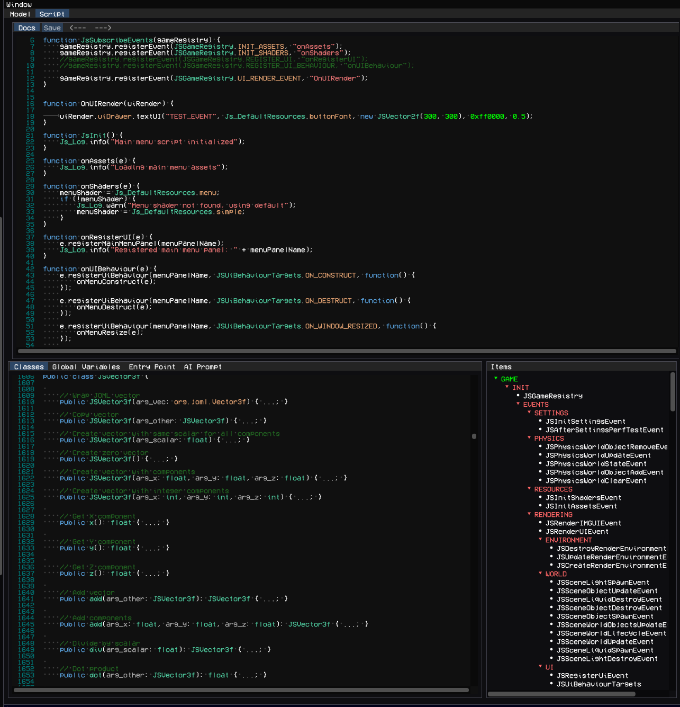
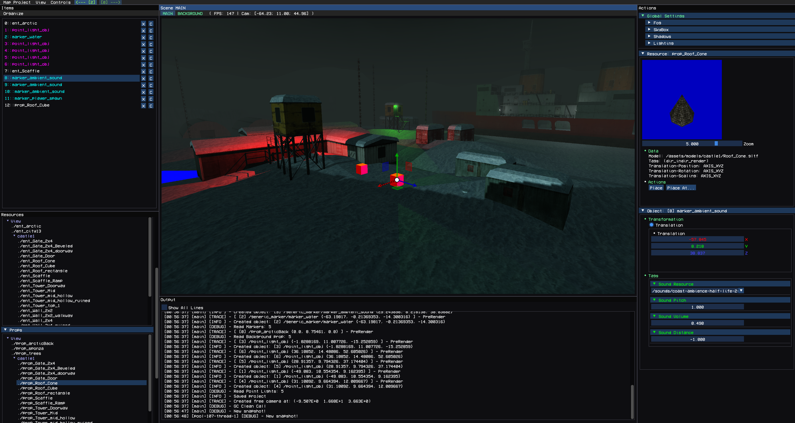

# WorkBench Editor

## Overview

WorkBench is the game editor for JavaGems3D.

It can be launched in two ways:

* by passing the runtime argument:

```text
workbench=true
```

* by running the prebuilt Windows `.bat` launcher from the ready release package

WorkBench is used for creating and managing:

* game projects
* assets
* maps
* scripts
* entities and props
* markers
* tags
* skyboxes
* editor configuration

Each game project works independently and has its own isolated resource space.
Multiple projects can exist at the same time.

When WorkBench starts, the user first enters the project hub where a new game project can be created or an existing one can be opened.

---

# Asset Editor


After opening a project, the user enters the Asset Editor.

This is the main workspace for managing game resources.

---

## Left Panel — Resources

The left panel contains both:

* imported OS files
* editor-created resources

### Supported Import Formats

### Models

* `.gltf`

### Textures

* `.png`
* `.jpg`
* `.jpeg`
* `.bmp`
* `.tga`

### Audio

* `.ogg`

The editor supports previewing:

* 3D models
* textures
* skyboxes
* audio playback

---

## Editor-Created Resources

### Entities

Physical world objects with physics simulation.

Used for gameplay objects that interact with the physics world.

---

### Props

Non-physical scene objects.

Used for decorative or static world elements.

---

### Tags

Custom user-defined attributes.

Tags can be attached to:

* entities
* props
* markers

They are later parsed during map loading and can be used inside events and custom game logic.
This allows developers to configure object-specific behavior directly from the editor.

---

### Skyboxes

Skyboxes are created from texture sets and used for environment rendering.

---

### Markers

Special utility objects.

Markers are parsed by the game and can trigger any custom developer-defined behavior.

They are commonly used for:

* spawn points
* triggers
* scripted events
* custom runtime actions

---

### Maps

Maps are created here and edited inside the separate Map Editor.

They are described in the next section.

---

### Scripts

Scripts can be:

* created
* edited

The editor includes:

* script documentation access, Java-styled
* script editing tools

There is also a built-in AI prompt field for generating code with external AI tools.



---

## Bottom Panel — Debug Console

The bottom panel contains the debugging console.

It displays:

* logs
* warnings
* errors
* runtime output

This is used for debugging both editor and game-side systems.

---

## Right Panel — Actions

The right panel is used for:

* selected object configuration
* object actions
* editor operations

It changes depending on the currently selected resource.

---

## Global Editor Settings

Additional editor settings are also available on the right side.

Examples:

* paths to required JAR files
* files used during compilation
* autosave parameters for Map Editor
* editor-specific global settings

---

## Center Panel — Preview Area

The center area is used for:

* model preview
* texture preview
* script editing
* skybox preview

---

## Top Panel — Main Menu

The main menu allows:

* launching the game for testing
* compiling the project
* saving changes
* exiting the editor

---

# Map Editor

The Map Editor works as a separate editor with its own isolated resource space.

It is focused entirely on level creation and scene management.




---

## Left Panel — Resources

Contains:

* entities
* props
* markers
* local map scripts

Several system entities, props, and markers are always available by default.

These are built-in editor resources required for map construction.

Local scripts specific to the current map can also be created here.

---

## Left Panel — Items

The Items section shows all objects currently placed on the map.

Users can:

* inspect objects
* select objects
* manage objects
* use context menu actions

---

## Top Panel — Main Menu

Available actions:

* save map
* exit editor
* launch current map inside the game
* undo
* redo

---

## Center Panel — Scene View

The center panel is the main 3D scene viewport.

Users can:

* place objects
* move objects
* rotate objects
* scale objects
* delete objects
* select objects directly in the world

### Scene Types

There are two scene layers:

### Main Scene

The primary gameplay scene.

### Background Scene

Used mainly for skybox rendering.

---

## Bottom Panel — Console

Displays:

* logs
* debug output
* errors

---

## Right Panel — Actions

Contains:

* selected object settings
* object parameters
* global map settings

Examples of global map settings:

* lighting
* shadows
* environment
* rendering settings
* scene configuration

This is where most map tuning is performed.

---

# API Extension

WorkBench can also be extended through the JavaGems3D API.

Currently, API extension is limited mostly to:

* registering default entities
* registering default props
* registering markers
* defining editor-side default resources

In future versions, editor extension capabilities will be expanded significantly.

This will allow deeper integration of custom gameplay systems directly into WorkBench.
